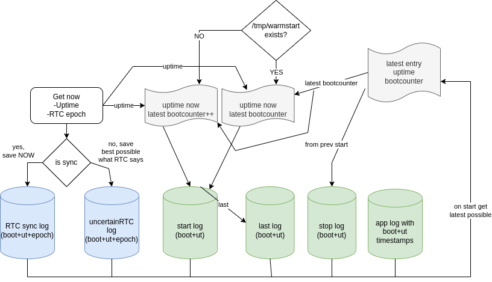

# TimeGopher
**Time flows forward, epoch=0, 1.1.1970 never returns**


This library is meant for applications that have to deal with timestamps, but do not have syncronized *wall clock* time always available when it is needed. This library provides way to store monotonic clock and convert it to *wall clock* time later when synchronization to RTC (by NTP for example) is available. This library provides also way to track software starts, stops (wanted and crashes) and system reboot times. Storage is implemented by *[fixregsto](https://github.com/hjkoskel/fixregsto)*
This library tries also to catch typical errors when dealing with timestamping (sanity checks added)

Typical application would be datalogger kind of embedded application.

>>**NOTICE!! THIS LIBRARY IS NOT _YET_ PRODUCTION READY**

Naive solution is to use calendar date&time in some standard format and hope that everything goes fine. Maybe fix timestamps later if system wall clock is synchronized or set manually.

Basic solution when logging timestamps is to use *[epoch timestamp](https://en.wikipedia.org/wiki/Epoch_(computing))*. wikipedia. It solves issues only with timezones and daylight savings. But still there is issue if epoch time is wrong while data and epoch timestamp is logged. As bad as *date and time* with timezone information.

One solution is to use monotonic clock that never moves back and never pauses while system is running. Always increases while computer runs. If synchronized wall clock time (epoch) is recorded with monotonic clock then. Golang time uses *[monotonic clock](https://pkg.go.dev/time#hdr-Monotonic_Clocks) when doing calculations with time.Time types.

There are good and bad monotonic sources. Linux have */proc/uptime* that tells uptime since kernel was started.
One way to create always monotonic clock is to combine system uptime and counter that counts how many boots system have experienced.

This timegopher library was created based on that idea.

Timegopher keeps following timestamp logs (bootcounter, uptime and epoch values)

- **RtcSyncLog**, every time when there is need to connect bootcounter and uptime to actual "wall clock"
- **UncertainRtcSyncLog**, created for storing uncertain sync events like pick best guess from RTC clock, or user enters actual time. secondary option if RtcSyncLog entry not available Optional feature
- **LastLog**, frequently updated live log when software was running. Optional feature. Not needed if start and stop logs are not required and software have some other updating datasources with *TimeVariable* timestamp
- **StartLog**, optional feature. Use if tracking software start timestamps is required in your application
- **StopLog**. optional feature. Use if tracking software stop timestamps is required in your application


# How to use

The first thing is to create one instance of *TimeGopher* when actual main application starts (a fresh start after boot or software restart) before any data is stored or timestamped.

While sofware is running, call Refresh method on TimeGopher. IF timestamps are needed on your data. Create those with Convert(time.Now()) on TimeGopher

There is example application *examples/templogger* that logs cpu temperature. (it also demonstrates some sub system features)


## Initializing TimeGopher
Creation of TimeGopher is done by calling NewTimeGopher( .

```go
func NewTimeGopher(
	timeNow time.Time,

	inSync bool,
	coldStart bool,

	rtcSyncLog *TimeFileDb,
	uncertainRtcSyncLog *TimeFileDb, //Optional

	startLog *TimeFileDb, //Optional
	stopLog *TimeFileDb, //Optional

	lastLog *TimeFileDb, //Last alive situation

	latestKnowTimeElsewhere TimeVariable, //If knows from latest stored timestamp on timeseries database
	uptimeCheck *UptimeChecker,
) (TimeGopher, error) {
```

If there is no need for fine grain control of things and using default disk storage implementation is ok and using *time.Now()* as time source is ok. Then *CreateDefaultTimeGopher* helps to generate few variables



Parameter *coldStart* can be resolved by having temporary flag file under /tmp. When linux kernel restarts /tmp folder is cleared. There is helper function *FirstCallAfterBoot* available for that
```go
isFirstRun, errfirstrun := tgopher.FirstCallAfterBoot("/tmp/coldstart")
```

Parameter *uptimeCheck* can be created by *CreateUptimeChecker* method. It have to be done once. Uptime checker uses more decimals than 0.01s available from /proc/uptime
```go
func CreateUptimeChecker() (UptimeChecker, error) {
```


## Initializing TimeGopher, easy way
```go
func CreateDefaultTimeGopher(
    rtcLogDir string,
    latestKnowTimeElsewhere TimeVariable) 
    
    (TimeGopher, error) {
```
Then you have to provide dedicated and persisted disk directory for time files as *rtcLogDir*. (depends on your application)

## Running TimeGopher

There are no goroutines in TimeGopher

For that reason *Refesh* function have to be called. It will update lastLog entries (so TimeGopher can say at next start when previous run stopped). Refresh also handles situation if system got realtime clock synced.

Calling *Refresh* too often can generates disk activity and exessive usage can lead to SSD/sdcard wearout.
```go
func (p *TimeGopher) Refresh(t time.Time, inSync bool) error
```

Parameter inSync True means that linux wall clock is set to correct time.
Parameter inSync can be resolved by using *RtcIsSynced_adjtimex* or by some other means. It is prefered to have sync value hold by actual software.

Parameter t can be generated by time.Now() function. 

Or in that case just call *RefreshNow()* function.
```go
func (p *TimeGopher) RefreshNow() error {
```

Relation in between uptime and epoch time can change if time synchronization fixes epoch time. Software can call *RtcDeviation* helper function with time.Now(). It will tell how much deviation will be. If it is too much, software must call Refresh function with inSync=false and after that inSync=true values. Then new entry is added to RTC sync log
```go
func (p *TimeGopher) RtcDeviation(t time.Time) (int64, error)
```

If software runs on device that do not have automatic time sync available (like NTP), but time is set manually by ui or physical buttons. Then application must call *DoUncertainTimeSync* or *DoUncertainTimeSyncNow* when that happens

```go
func (p *TimeGopher) DoUncertainTimeSync(t time.Time) error
func (p *TimeGopher) DoUncertainTimeSyncNow() error {
```


## Converting timestamps with TimeGopher
When timeorganizer is created, it provides following conversion functions.
Convert function is needed when data timestamps are converted to more storeable TimeVariable format.
Instead of time.Time. Actual time.Time can be solved by Unconvert or SolveTime when there have been RTC sync.

```go
func (p *TimeGopher) Convert(t time.Time) (TimeVariable, error)
func (p *TimeGopher) Unconvert(tv TimeVariable) (time.Time, error)
func (p *TimeGopher) SolveTime(boot int32, uptime NsUptime) (time.Time, error) //Calls unconvert
```


Sometimes software can restart while operational system does not boot (like "quiet restart" style in embedded devices). Software might need to do some initialization procedures at cold start. But not at warms start.

Function *IsColdStart* is getter function that returns coldStart flag set at creation of TimeGopher
```go
func (p *TimeGopher) IsColdStart() bool
```

